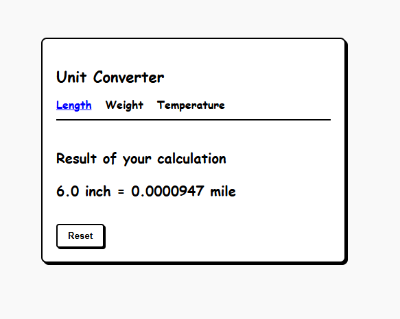

# Unit Converter

A web-based **Unit Converter** built with [Django](https://www.djangoproject.com/).  
This project supports converting values between multiple units such as **Length, Temperature, and Weight**.  

---

## 📖 About the Project
This project was created as a **practice project** inspired by [roadmap.sh](https://roadmap.sh), an open-source community that provides developer roadmaps and project ideas.  

Original project idea: [Unit Converter – roadmap.sh Projects](https://roadmap.sh/projects/unit-converter)  

---

## 🚀 Features
- 🌡️ **Temperature Conversion** (Celsius ↔ Fahrenheit ↔ Kelvin)  
- 📏 **Length Conversion** (Meters ↔ Kilometers ↔ Miles ↔ Feet, etc.)  
- ⚡ Single **Result Page** shared across all converters  
- 🎨 Responsive UI with simple CSS styling  
- ⚠️ Input validation (error messages for empty/invalid inputs)  

---

## 🗂️ Project Structure
unit-converter/        # Root of the repository  
├── config/            # Django project settings  
│   ├──config/        # Inner settings module (urls.py, settings.py, wsgi.py, etc.)  
│   ├── converter/         # Django app with forms, views, templates 
│   ├── db.sqlite3         # SQLite database (default)  
│   └── manage.py          # Django management script  
├── requirements.txt   # Project dependencies  
├── README.md          # This file  
└── LICENSE            # License file  
└──
---

## 🔧 Installation & Setup
Follow these steps to run the project locally:

1. Clone the repository  
   git clone https://github.com/Arshiya-Bagheri/unit-converter.git  
   cd unit-converter  

2. Create a virtual environment (recommended)  
   python -m venv venv  
   source venv/bin/activate   # On macOS/Linux  
   venv\Scripts\activate      # On Windows  

3. Install dependencies  
   pip install -r requirements.txt  

4. Start the development server  
   python manage.py runserver  

Now open your browser and go to **http://127.0.0.1:8000/** 🎉  

---

## 📸 Screenshots
### Homepage

### Conversion Result

*(You can add screenshots by placing them inside a `docs/screenshots/` folder and updating the links above.)*  

---

## 📦 Requirements
- Python 3.11+  
- Django 5.x  
All dependencies are listed in `requirements.txt`.  

---

## 🛠️ Future Improvements
- Add more unit categories (Volume, Speed, etc.)  
- Add user authentication (history of conversions per user)  
- Deploy on a cloud platform (Heroku, Render, etc.)  

---

## 📜 License
This project is licensed under the **GNU General Public License v3.0 (GPLv3)**.  
See the [LICENSE](./LICENSE) file for more details.  

---

## 👤 Author
**Arshiya Bagheri**   
- ✉️ Email: arshiyabagheri7@gmail.com  
